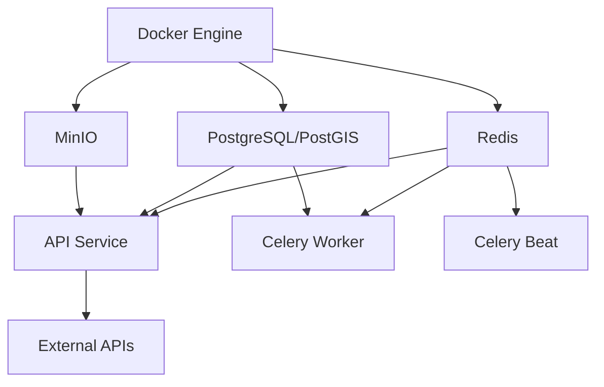

# ARGUS PLATFORM - COMPREHENSIVE SERVICES STATUS REPORT
## Generated: 2026-04-08 12:05:12

---

## Executive Summary

**Overall Readiness:** 67% (2/3 Critical Components Ready)

### Status Overview
| Component | Status | Details |
|-----------|--------|---------|
| Docker Engine | βœ… OPERATIONAL |  Version 28.5.1 |
| Service Containers | ❌ NOT RUNNING | 0/6 services active |
| Environment Configuration | βœ… CONFIGURED | 79/94 variables set (84%) |

**CRITICAL ISSUE:** Docker Compose services are not currently running. All services are in PENDING state.

---

## Section 1: Docker Infrastructure

### Docker Engine Status
- **Status:** βœ… OPERATIONAL
- **Version:** 28.5.1 (Client & Server)
- **Running Containers:** 0
- **Total Containers:** 1 (1 stopped: sweet_black - old Redis instance)

### Container Details
| Name | Image | Status |
|------|-------|--------|
| sweet_black | redis:7-alpine | ⏹️ Exited (0) 10 days ago |

**Analysis:** Docker Engine is healthy, but no ARGUS services are currently running.

---

## Section 2: Docker Compose Services

### Service Status: ⚠️ NOT RUNNING

All 6 expected services are in PENDING state:

| Service | Description | Port(s) | Status |
|---------|-------------|---------|--------|
| redis | Redis Cache | 6379 | ⏳ PENDING |
| db | PostgreSQL/PostGIS Database | 5432 | ⏳ PENDING |
| minio | MinIO Object Storage | 9000, 9001 | ⏳ PENDING |
| api | FastAPI Application Server | 8000 | ⏳ PENDING |
| worker | Celery Background Worker | - | ⏳ PENDING |
| beat | Celery Beat Task Scheduler | - | ⏳ PENDING |

**Root Cause:** Services have not been started with `docker-compose up`

---

## Section 3: Environment Configuration

### Configuration File Status
- **File:** βœ… .env exists and is properly formatted
- **Total Variables:** 94
- **Configured:** 79
- **Coverage:** 84.0%

### External API Credentials Status

| Service | API/Component | Status |
|---------|--------------|--------|
| βœ… | ACLED Conflict Data (Email) | CONFIGURED |
| βœ… | ACLED OAuth2 (Password) | CONFIGURED |
| βœ… | OpenSky Aviation (Username) | CONFIGURED |
| βœ… | OpenSky Aviation (Password) | CONFIGURED |
| βœ… | AIS Stream Maritime | CONFIGURED |
| ❌ | RapidAPI Services | NOT SET (Optional) |
| ❌ | Copernicus/Sentinel-2 Imagery | NOT SET (Optional) |
| βœ… | NASA FIRMS Fire Detection | CONFIGURED |

**Analysis:** All critical external API credentials are configured. Missing items are optional backup services.

---

## Section 4: Deployment Readiness Assessment

### Component Checklist

| Component | Required | Status | Impact |
|-----------|----------|--------|--------|
| Docker Engine | βœ… Yes | βœ… PASS | Ready |
| Service Containers (6) | βœ… Yes | ❌ FAIL | **BLOCKING** |
| Environment Config | βœ… Yes | βœ… PASS | Ready |

### Readiness Score: **67%** (2/3 checks passed)

**Blocking Issue:** Service containers not running

---

## Section 5: Required Actions

### IMMEDIATE ACTIONS REQUIRED

#### 1️⃣ Build and Start Docker Services
```powershell
# Build application images (may take 10-15 minutes on first run)
docker-compose build

# Start all services in detached mode
docker-compose up -d

# Verify all services are healthy
docker-compose ps
```

#### 2️⃣ Monitor Service Startup
```powershell
# Follow API logs to monitor startup
docker-compose logs -f api

# Check all service logs
docker-compose logs --tail=100
```

#### 3️⃣ Verify Services Are Healthy
```powershell
# Expected output: 6 services in 'Up' state
docker-compose ps

# Check API health endpoint
curl http://localhost:8000/health

# Access API documentation
Start-Process http://localhost:8000/docs
```

#### 4️⃣ Test External API Connectivity
```powershell
# Run comprehensive connectivity test
python verify_data_sources.py

# This will test:
# - ACLED (OAuth2 authentication)
# - OpenSky Network (Aviation data)
# - AIS Stream (Maritime traffic)
# - NASA FIRMS (Fire detection)
# - All other configured external services
```

---

## Section 6: Expected Timeline

| Phase | Duration | Status |
|-------|----------|--------|
| Docker Compose Build | 10-15 min (first time) | ⏳ Not Started |
| Service Initialization | 2-3 min | ⏳ Pending |
| Database Migrations | 1 min | ⏳ Pending |
| Health Checks | 30 sec | ⏳ Pending |
| **Total** | **~15-20 min** | ⏳ Ready to Begin |

**Note:** Subsequent starts will be much faster (~30 seconds) as images will be cached.

---

## Section 7: Service Dependencies



All services depend on Docker Engine (βœ… Ready). Once started, services will initialize in dependency order.

---

## Section 8: Post-Deployment Verification Checklist

- [ ] All 6 containers show 'Up' status in `docker-compose ps`
- [ ] API responds at http://localhost:8000/health
- [ ] MinIO console accessible at http://localhost:9001
- [ ] Database migrations complete (check `docker-compose logs db`)
- [ ] `python verify_data_sources.py` passes for all configured APIs
- [ ] No errors in `docker-compose logs --tail=50`

---

## Section 9: Troubleshooting

### If Services Fail to Start

1. **Check Docker Resources:**
   ```powershell
   docker system info
   # Ensure adequate memory (8GB+ recommended)
   ```

2. **View Error Logs:**
   ```powershell
   docker-compose logs --tail=100
   ```

3. **Rebuild from Scratch:**
   ```powershell
   docker-compose down -v  # Remove volumes
   docker-compose build --no-cache  # Rebuild without cache
   docker-compose up -d
   ```

4. **Check Port Conflicts:**
   ```powershell
   # Ensure ports 5432, 6379, 8000, 9000, 9001 are available
   netstat -ano | findstr "5432"
   netstat -ano | findstr "6379"
   netstat -ano | findstr "8000"
   netstat -ano | findstr "9000"
   ```

---

## Conclusion

### Current State
The ARGUS platform is **67% ready** for deployment. Docker Engine and environment configuration are properly set up. The only remaining step is to start the Docker Compose services.

### Next Steps
1. Run `docker-compose build` to create application images
2. Run `docker-compose up -d` to start all services
3. Verify health with `docker-compose ps` and `curl http://localhost:8000/health`
4. Test external APIs with `python verify_data_sources.py`

### Estimated Time to Full Operation
**15-20 minutes** from now (first-time build + startup)

---

**Report Generated:** 2026-04-08 12:05:12  
**Report Location:** `SERVICES_STATUS_REPORT.md`  
**Supporting Files:** `CURRENT_STATUS_REPORT.txt` (plain text version)

---
